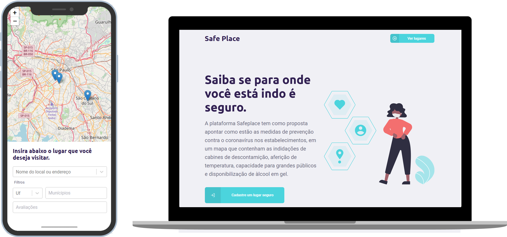

<h1 align="center">
   Safe Place
</h1>

  <a href="#-tecnologias">Tecnologias</a>&nbsp;&nbsp;&nbsp;|&nbsp;&nbsp;&nbsp;
  <a href="#-projeto">Projeto</a>&nbsp;&nbsp;&nbsp;|&nbsp;&nbsp;&nbsp;
  <a href="#-layout">Layout</a>&nbsp;&nbsp;&nbsp;|&nbsp;&nbsp;&nbsp;
   <a href="#-repositorios">Repositórios</a>&nbsp;&nbsp;&nbsp;|&nbsp;&nbsp;&nbsp;
  <a href="#-grupo">Grupo</a>&nbsp;&nbsp;&nbsp;|&nbsp;&nbsp;&nbsp;
  <a href="#memo-licença">Licença</a>

<h2 align="center" style="color:#4BD4DD">
  Back-End
</h2>

 

  

 

  

## 🏃‍♀️ Run Project

- o projeto necessita do nodejs e yarn instalados na sua máquina
- o projeto utiliza um banco de dados local postegres, é necessário rodar os passos abaixo para que funcione

comandos de terminal:

- iniciar o banco de dados `yarn knex:migrate:latest`
- popular banco de dados com dados inicias `yarn knex:seed`
- iniciar back-end `yarn dev`

ao rodar o comando _dev_ uma mensagem no terminal irá ser exibido `server is ready`. certifique-se de que o exista um arquivo nesse caminho `src\database\database.sqlite`

## 🚀 Tecnologias

Esse projeto foi desenvolvido com as seguintes tecnologias:

- [Node.js](https://nodejs.org/en/)
- [React](https://reactjs.org)
- [React Native](https://facebook.github.io/react-native/)
- [Expo](https://expo.io/)
- [TypeScript](https://www.typescriptlang.org/)

## 💻 Projeto

A plataforma Safeplace tem como proposta apontar como estão as medidas de prevenção contra o coronavírus nos estabelecimentos, em um mapa que contenham as indidações de cabines de descontamição, aferição de temperatura, capacidade para grandes públicos e disponibilização de àlcool em gel.💜

## 🔖 Layout

Nos links abaixo você encontra o layout do projeto web e também do mobile. Lembrando que você precisa ter uma conta no [Figma](http://figma.com/) para acessá-lo.

- [Layout Web](https://www.figma.com/file/F4afuT1JkLOA9iE3Wn7T42/Landing-Page?node-id=0%3A1)

## 🧠 Repositorios

No links a seguir você encontra o front-end, back-end e mobile do projeto

- [Front-end](https://github.com/Dev4ster/safe-place-front-end/)
- [Back-end](https://github.com/Dev4ster/safe-place-back-end/)

## 👨‍🎓 Grupo

| Nome                   | Ra      | Função                                                                                                       | Linkedin | Github |
| ---------------------- | ------- | ------------------------------------------------------------------------------------------------------------ | -------- | ------ |
| Victor Menezes         | 1692977 | Desenvolvedor Full-Stack: responsável pelo desenvolvimento da plataforma front-end e back-end                |          |        |
| Andrea Guazzelli       | 8909872 | Desenvolvedora Full-Stack: responsável pelo desenvolvimento da plataforma front-end e back-end               |          |        |
| Henrique Braz de Godoy | 7491931 | Designer UX/UI: responsável pela concepção visual e pela expêriencia de uso da plataforma                    |          |        |
| Ana Carolina Moda      | 1720294 | Gestora do Projeto: responsável pela gestão das tarefas, organização do cronograma e documentação do projeto |          |        |

## :memo: Licença

Esse projeto está sob a licença MIT. Veja o arquivo [LICENSE](LICENSE.md) para mais detalhes.

---
